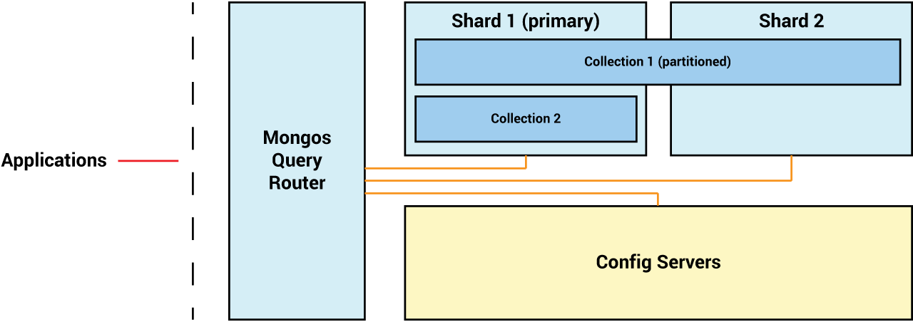

# Mongodb-sharded-docker-compose: Production Architecture
## Architecture:
- One config replica set, single query router (mongos)
- Two shards with each shard is replica set with 1 PRIMARY and 2 SECONDARY

## Setup:  

##### 1. Run  

`docker-compose up`

##### 2. Setup configs servers  

`mongosh mongodb://localhost:10001`   
`rs.initiate(
  {
    _id: "cfgrs",
    configsvr: true,
    members: [
      { _id : 0, host : "configs1:27017" },
      { _id : 1, host : "configs2:27017" },
      { _id : 2, host : "configs3:27017" }
    ]
  }
)`    
`exit`  

##### 3. Setup shard servers  

`mongosh mongodb://localhost:20001`    
`rs.initiate( {
    _id: "shard1",
    members: [
      { _id : 0, host : "shard11:27017" },
      { _id : 1, host : "shard12:27017" }, 
      { _id : 2, host : "shard13:27017" },
    ]
  })`   
`exit`  
`mongosh mongodb://localhost:20004`   
`rs.initiate( {
    _id: "shard2",
    members: [
      { _id : 0, host : "shard21:27017" }, 
      { _id : 1, host : "shard22:27017"},
      { _id : 2, host : "shard23:27017"}
       ]
     })`  
`exit`  

##### 4. Add Shards to the Cluster  

`mongosh  mongodb://localhost:30000`    
`sh.addShard("shard1/shard11:27017,shard12:27017,shard13:27017")`  
`sh.addShard("shard2/shard21:27017,shard22:27017,shard23:27017")`  
`sh.status()`  

##### 5. Enable Sharding for a Database and Collection  

`sh.enableSharding("testdb")`  
`sh.shardCollection("testdb.testtable", { testcol: "hashed" } )`
or `sh.shardCollection("testdb.testtable", { testcol: 1 } )`

_* Note: We can shard an existing collection: [https://dba.stackexchange.com/questions/207196/mongodb-sharding-an-collection-with-data-already-in-it](https://dba.stackexchange.com/questions/207196/mongodb-sharding-an-collection-with-data-already-in-it)_

##### 6. Create exmaple data:  

{
    "name": "Tokyo",
    "country": "Japan",
    "continent": "Asia",
    "population": 37.400
}  

###### Create and enable sharding database  

`mongosh  mongodb://localhost:30000`  
`sh.enableSharding("populations")`  
`sh.shardCollection("populations.cities", { "country": "hashed" })`  
`use populations`  

###### Insert data using below command  

`db.cities.insertMany([
    {"name": "Seoul", "country": "South Korea", "continent": "Asia", "population": 25.674 },
    {"name": "Mumbai", "country": "India", "continent": "Asia", "population": 19.980 },
    {"name": "Lagos", "country": "Nigeria", "continent": "Africa", "population": 13.463 },
    {"name": "Beijing", "country": "China", "continent": "Asia", "population": 19.618 },
    {"name": "Shanghai", "country": "China", "continent": "Asia", "population": 25.582 },
    {"name": "Osaka", "country": "Japan", "continent": "Asia", "population": 19.281 },
    {"name": "Cairo", "country": "Egypt", "continent": "Africa", "population": 20.076 },
    {"name": "Tokyo", "country": "Japan", "continent": "Asia", "population": 37.400 },
    {"name": "Karachi", "country": "Pakistan", "continent": "Asia", "population": 15.400 },
    {"name": "Dhaka", "country": "Bangladesh", "continent": "Asia", "population": 19.578 },
    {"name": "Rio de Janeiro", "country": "Brazil", "continent": "South America", "population": 13.293 },
    {"name": "São Paulo", "country": "Brazil", "continent": "South America", "population": 21.650 },
    {"name": "Mexico City", "country": "Mexico", "continent": "North America", "population": 21.581 },
    {"name": "Delhi", "country": "India", "continent": "Asia", "population": 28.514 },
    {"name": "Buenos Aires", "country": "Argentina", "continent": "South America", "population": 14.967 },
    {"name": "Kolkata", "country": "India", "continent": "Asia", "population": 14.681 },
    {"name": "New York", "country": "United States", "continent": "North America", "population": 18.819 },
    {"name": "Manila", "country": "Philippines", "continent": "Asia", "population": 13.482 },
    {"name": "Chongqing", "country": "China", "continent": "Asia", "population": 14.838 },
    {"name": "Istanbul", "country": "Turkey", "continent": "Europe", "population": 14.751 }
])`  

###### Check sharding stat  

`db.cities.getShardDistribution()`  
`db.cities.find().explain()`  
`db.cities.find({"country": "Japan"}).explain()`  

#### 7. Clean all  

`docker-compose down -v --rmi all`  

##### Reference Docs:  
1. https://www.digitalocean.com/community/tutorials/how-to-use-sharding-in-mongodb#step-3-running-mongos-and-adding-shards-to-the-cluster  
2. https://phoenixnap.com/kb/mongodb-sharding  
3. https://www.mongodb.com/docs/v6.0/core/sharded-cluster-high-availability/
